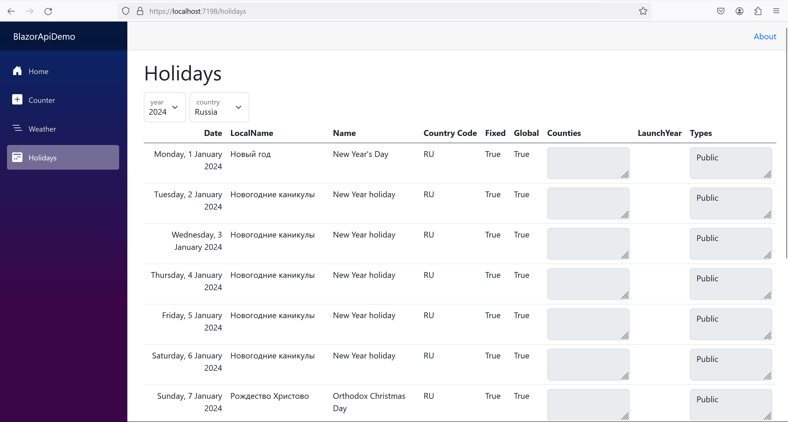
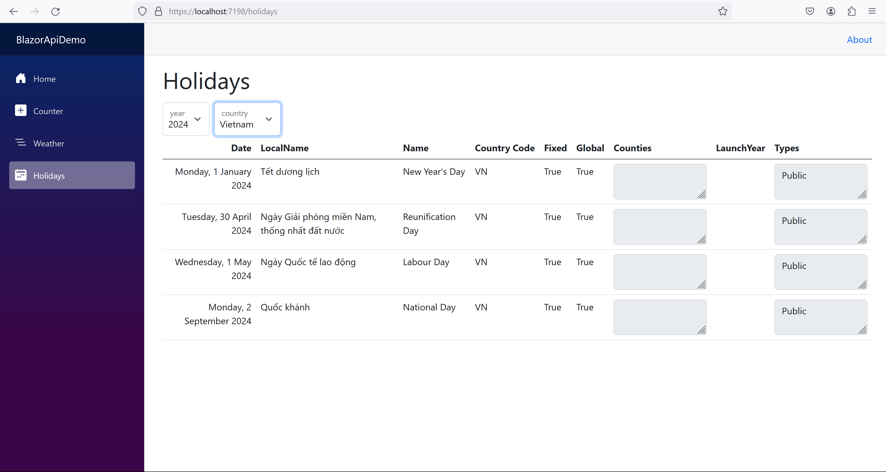
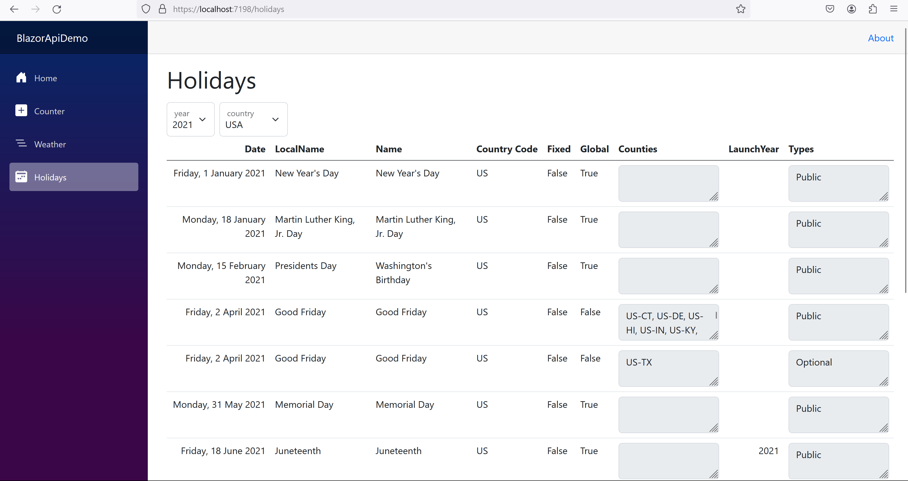

# BlazorApiDemoApp

    


The web app is build with Blazor.\
It uses Interactive Server mode to ensure interactivity on the client side.


<details>
  <summary><i>UI Screenshots</i></summary>




</details>

## How to run the app

1. Navigate to the source code folder. Assume it is "BlazorApiDemoApp" located in "home" directory:

    ```pwsh

    cd ~/BlazorApiDemoApp/BlazorApiDemo

    ```

2. Run the app:

    ```

    dotnet run

    ```

## Dependencies

The app is build with Blazor and targets .NET 8 (LTS).\
You need to have .NET 8 Runtime installed in order to run the app.\
Visit <a href="https://dotnet.microsoft.com/en-us/download/dotnet/8.0">Microsoft website</a> for more information.